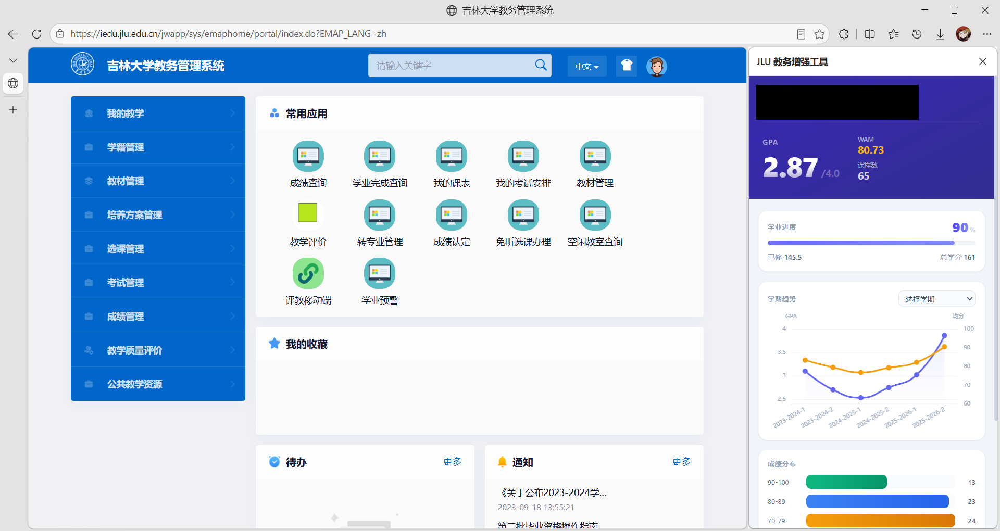

<p align="center">
  <h2 align="center">JLU 成绩查询助手</h2>
  <p align="center">吉林大学教务系统成绩管理浏览器扩展</p>
</p>

<p align="center">
  
  
  
</p>

在教务系统侧边栏中实时查看成绩、计算 GPA、追踪学业进度。支持按课程自定义计算，灵活适配各学院保研政策。

---

## 功能

| | |
|---|---|
| **成绩查询** | 侧边栏实时展示所有课程成绩，支持五级制自动转换 |
| **GPA 计算** | 总绩点、加权平均分（WAM）、必修/选修绩点一目了然 |
| **自定义选择** | 按课程勾选计算 GPA，适配不同学院保研政策 |
| **方案管理** | 保存多套选课方案，一键切换，跨会话持久化 |
| **学期趋势** | 折线图可视化各学期 GPA 与均分变化 |
| **成绩分布** | 分数段课程数量统计，直观了解成绩结构 |
| **学业进度** | 已修学分 vs 培养方案总学分，进度清晰可见 |
| **极值速览** | 最高分 / 最低分课程快速定位 |

## 截图



## 安装

### 从源码构建

```bash
git clone https://github.com/vivi2048/jlu-grade-tool.git
cd jlu-grade-tool
npm install
npm run build
```

然后在浏览器中加载：

1. 打开 `chrome://extensions/`（Edge 为 `edge://extensions/`）
2. 开启「开发者模式」
3. 点击「加载已解压的扩展程序」
4. 选择项目中的 `dist` 文件夹

### 使用预构建版本

前往 [Releases](https://github.com/vivi2048/jlu-grade-tool/releases) 下载最新 `jlu-grade-tool.zip`，解压后按上述步骤 1-4 加载。

## 使用

1. 访问 [iedu.jlu.edu.cn](https://iedu.jlu.edu.cn) 并登录
2. 点击浏览器工具栏扩展图标 → 选择「在侧边栏中打开」
3. 成绩数据自动加载

### 自定义课程选择

选择学期后，通过复选框勾选需要计入的课程，GPA 会实时重新计算。支持将选择保存为命名方案（如「计科保研」「不含体育」），下次一键加载：

- 展开学期列表上方的「方案管理」面板
- 输入方案名称，点击「保存」
- 之后可随时切换或删除已保存的方案

## 开发

```bash
# 开发模式（支持热更新）
npm run dev

# 生产构建
npm run build

# 打包 Release zip
node scripts/package.js
```

**技术栈：** React 19 · TypeScript · Vite · Tailwind CSS v4 · ECharts

```
src/
├── api/          # 教务系统 API 请求
├── core/         # 统计计算核心逻辑
├── hooks/        # 自定义 Hooks
├── types/        # TypeScript 类型定义
└── styles/       # 全局样式与动画
```

## 隐私

- 所有数据在本地处理和显示，不上传至任何服务器
- 课程选择方案存储于浏览器本地（`localStorage` + `chrome.storage.local`）
- 仅在 `iedu.jlu.edu.cn` 域名下激活

## 贡献

欢迎提交 Issue 和 Pull Request。

## 许可证

[MIT License](LICENSE)

---

<sub>本扩展仅供学习交流，与吉林大学官方无关。使用即表示自行承担风险。</sub>
